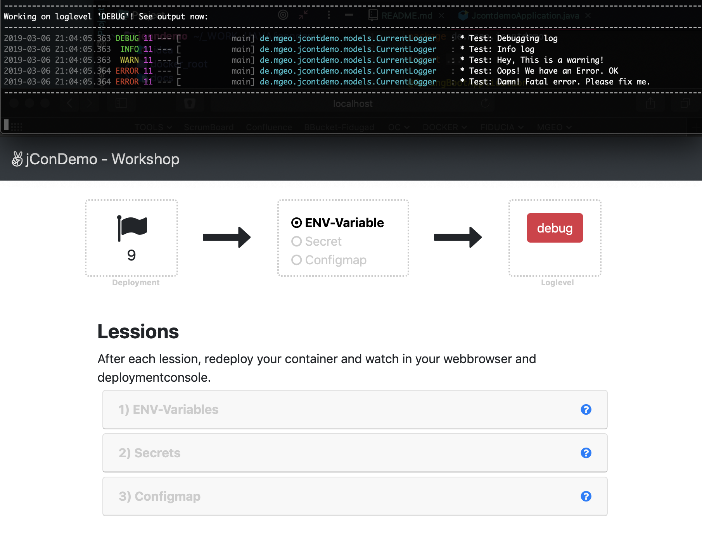

# Container Tester
Springboot based containertester for secrets and environmentvariables. 


### Java Build & Run
```
    mvn clean install && java -jar target/jcontester-0.0.8.jar
```

### Docker Build & run

Build with [this Makefile](Makefile)
```
      make docker.build
      make docker.test
      
      #or
      #make build
      
      #or
      #make test.env
      #make test.secret
```

```
    docker run -ti --rm -p 8080:8080 -e LOGLEVEL_APP=debug dockermgeo/jcontester
```


### Outputs
The output test of the logger as well as the secrets are displayed
* in the terminal output, the log outputs are now displayed depending on the log level
* in the web browser on the port that has been set (default 8080)



